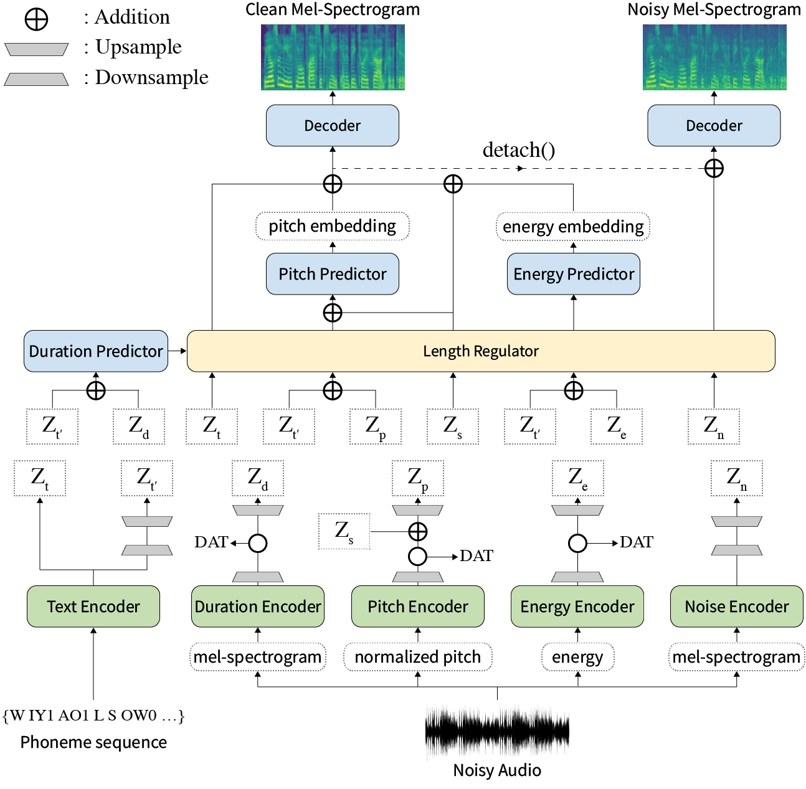
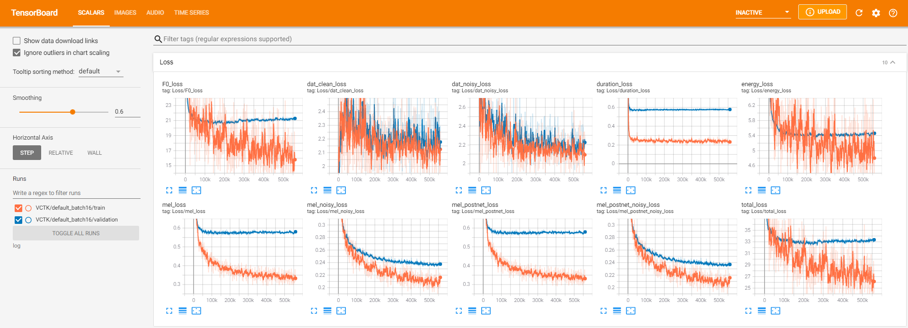
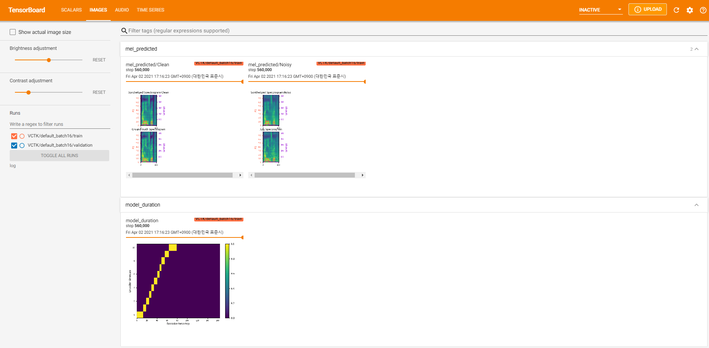
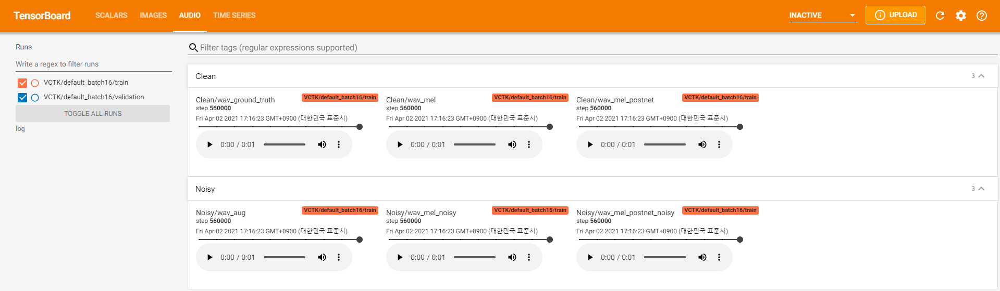
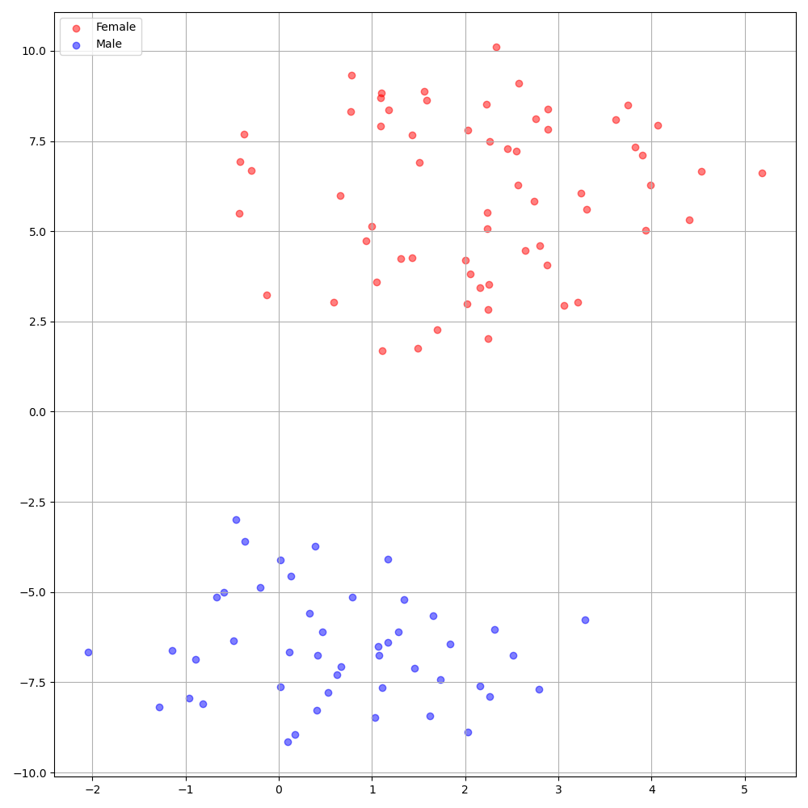

[](https://hits.seeyoufarm.com)
# STYLER: Style Factor Modeling with Rapidity and Robustness via Speech Decomposition for Expressive and Controllable Neural Text to Speech

### Keon Lee, Kyumin Park, Daeyoung Kim

In our [paper](https://arxiv.org/abs/2103.09474), we propose STYLER, a non-autoregressive TTS framework with style factor modeling that achieves rapidity, robustness, expressivity, and controllability at the same time.

<p align="center">
    
</p>

**Abstract:** Previous works on neural text-to-speech (TTS) have been addressed on limited speed in training and inference time, robustness for difficult synthesis conditions, expressiveness, and controllability. Although several approaches resolve some limitations, there has been no attempt to solve all weaknesses at once. In this paper, we propose STYLER, an expressive and controllable TTS framework with high-speed and robust synthesis. Our novel audio-text aligning method called Mel Calibrator and excluding autoregressive decoding enable rapid training and inference and robust synthesis on unseen data. Also, disentangled style factor modeling under supervision enlarges the controllability in synthesizing process leading to expressive TTS. On top of it, a novel noise modeling pipeline using domain adversarial training and Residual Decoding empowers noise-robust style transfer, decomposing the noise without any additional label. Various experiments demonstrate that STYLER is more effective in speed and robustness than expressive TTS with autoregressive decoding and more expressive and controllable than reading style non-autoregressive TTS. Synthesis samples and experiment results are provided via our [demo page](https://keonlee9420.github.io/STYLER-Demo/), and [code](https://github.com/keonlee9420/STYLER) is available publicly.


# Dependencies

Please install the python dependencies given in `requirements.txt`.

```bash
pip3 install -r requirements.txt
```

# Training

## Preparation

### Clean Data

1. Download [VCTK](https://datashare.ed.ac.uk/handle/10283/3443) dataset and resample audios to a 22050Hz sampling rate.
2. We provide a bash script for the resampling. Refer to `data/resample.sh` for the detail.
3. Put audio files and corresponding text (transcript) files in the same directory. Both audio and text files must have the same name, excluding the extension.
4. You may need to trim the audio for stable model convergence. Refer to [Yeongtae's preprocess_audio.py](https://github.com/Yeongtae/tacotron2/blob/master/preprocess_audio.py) for helpful preprocessing, including the trimming.
5. Modify the `hp.data_dir` in `hparams.py`.

### Noisy Data

1. Download [WHAM!](http://wham.whisper.ai/) dataset and resample audios to a 22050Hz sampling rate.
2. Modify the `hp.noise_dir` in `hparams.py`.

### Vocoder

1. Unzip `hifigan/generator_universal.pth.tar.zip` in the same directory.

## Preprocess

First, download [ResCNN Softmax+Triplet pretrained model](https://drive.google.com/file/d/1F9NvdrarWZNktdX9KlRYWWHDwRkip_aP) of [philipperemy's DeepSpeaker](https://github.com/philipperemy/deep-speaker) for the speaker embedding as described in our [paper](https://arxiv.org/abs/2103.09474) and locate it in `hp.speaker_embedder_dir`.

Second, download the [Montreal Forced Aligner](https://montreal-forced-aligner.readthedocs.io/en/latest/)(MFA) package and the pretrained (LibriSpeech) lexicon file through the following commands. MFA is used to obtain the alignments between the utterances and the phoneme sequences as FastSpeech2.

```bash
wget https://github.com/MontrealCorpusTools/Montreal-Forced-Aligner/releases/download/v1.1.0-beta.2/montreal-forced-aligner_linux.tar.gz
tar -zxvf montreal-forced-aligner_linux.tar.gz

wget http://www.openslr.org/resources/11/librispeech-lexicon.txt -O montreal-forced-aligner/pretrained_models/librispeech-lexicon.txt
```

Then, process all the necessary features. You will get a `stat.txt` file in your `hp.preprocessed_path/`. You have to modify the f0 and energy parameters in the `hparams.py` according to the content of `stat.txt`.

```bash
python3 preprocess.py
```

Finally, get the noisy data separately from the clean data by mixing each utterance with a randomly selected piece of background noise from WHAM! dataset.

```bash
python3 preprocess_noisy.py
```

## Train

Now you have all the prerequisites! Train the model using the following command:

```bash
python3 train.py
```

# Inference

## Prepare Texts

Create `sentences.py` in `data/` which has a python list named `sentences` of texts to be synthesized. Note that `sentences` can contain more than one text.

```bash
# In 'data/sentences.py',
sentences = [
    "Nothing is lost, everything is recycled."
]
```

## Prepare Reference Audios

Reference audio preparation has a similar process to training data preparation. There could be two kinds of references: clean and noisy.

First, put clean audios with corresponding texts in a single directory and modify the `hp.ref_audio_dir` in `hparams.py` and process all the necessary features. Refer to the `Clean Data` section of `Train Preparation`.

```bash
python3 preprocess_refs.py
```

Then, get the noisy references.

```bash
python3 preprocess_noisy.py --refs
```

## Synthesize

The following command will synthesize all combinations of texts in `data/sentences.py` and audios in `hp.ref_audio_dir`.

```bash
python3 synthesize.py --ckpt CHECKPOINT_PATH
```

Or you can specify single reference audio in `hp.ref_audio_dir` as follows.

```bash
python3 synthesize.py --ckpt CHECKPOINT_PATH --ref_name AUDIO_FILENAME
```

Also, there are several useful options.

1. `--speaker_id` will specify the speaker. The specified speaker's embedding should be in `hp.preprocessed_path/spker_embed`. The default value is `None`, and the speaker embedding is calculated at runtime on each input audio.
2. `--inspection` will give you additional outputs that show the effects of each encoder of STYLER. The samples are the same as the `Style Factor Modeling` section on our [demo page](https://keonlee9420.github.io/STYLER-Demo/).
3. `--cont` will generate the samples as the `Style Factor Control` section on our [demo page](https://keonlee9420.github.io/STYLER-Demo/).

   ```bash
   python3 synthesize.py --ckpt CHECKPOINT_PATH --cont --r1 AUDIO_FILENAME_1 --r2 AUDIO_FILENAME_1
   ```

   Note that `--cont` option is only working on preprocessed data. In detail, the audios' name should have the same format as VCTK dataset (e.g., p323_229), and the preprocessed data must be existing in `hp.preprocessed_path`.

# TensorBoard

The TensorBoard loggers are stored in the ``log`` directory. Use

```bash
tensorboard --logdir log
```

to serve the TensorBoard on your localhost.
Here are some logging views of the model training on VCTK for 560k steps.

<p align="center">
    
</p>
<p align="center">
    
</p>
<p align="center">
    
</p>

# Notes

1. There were too many noise data where extraction was not possible through `pyworld` as in clean data. To resolve this, `pysptk` was applied to extract log f0 for the noisy data's fundamental frequency. The `--noisy_input` option will automate this process during synthesizing.
2. If MFA-related problems occur during running `preprocess.py`, try to manually run MFA by the following command.

   ```bash
   # Replace $data_dir and $PREPROCESSED_PATH with ./VCTK-Corpus-92/wav48_silence_trimmed and ./preprocessed/VCTK/TextGrid, for example
   ./montreal-forced-aligner/bin/mfa_align $YOUR_data_dir montreal-forced-aligner/pretrained_models/librispeech-lexicon.txt english $YOUR_PREPROCESSED_PATH -j 8
   ```
3. DeepSpeaker on VCTK dataset shows clear identification among speakers. The following figure shows the T-SNE plot of extracted speaker embedding in our experiments.

   <p align="center">
        
    </p>
4. Currently, `preprocess.py` divides the dataset into two subsets: train and validation set. If you need other sets, such as a test set, the only thing to do is modifying the text files (`train.txt` or `val.txt`) in `hp.preprocessed_path/`.

# Citation
If you would like to use or refer to this implementation, please cite our paper with the repo.
```bash
@article{lee2021styler,
  title={STYLER: Style Modeling with Rapidity and Robustness via SpeechDecomposition for Expressive and Controllable Neural Text to Speech},
  author={Lee, Keon and Park, Kyumin and Kim, Daeyoung},
  journal={arXiv preprint arXiv:2103.09474},
  year={2021}
}
```

# References

- [ming024's FastSpeech2](https://github.com/ming024/FastSpeech2)
- [auspicious3000's SpeechSplit](https://github.com/auspicious3000/SpeechSplit)
- [philipperemy's DeepSpeaker](https://github.com/philipperemy/deep-speaker)
- [jik876's HiFi-GAN](https://github.com/jik876/hifi-gan)
